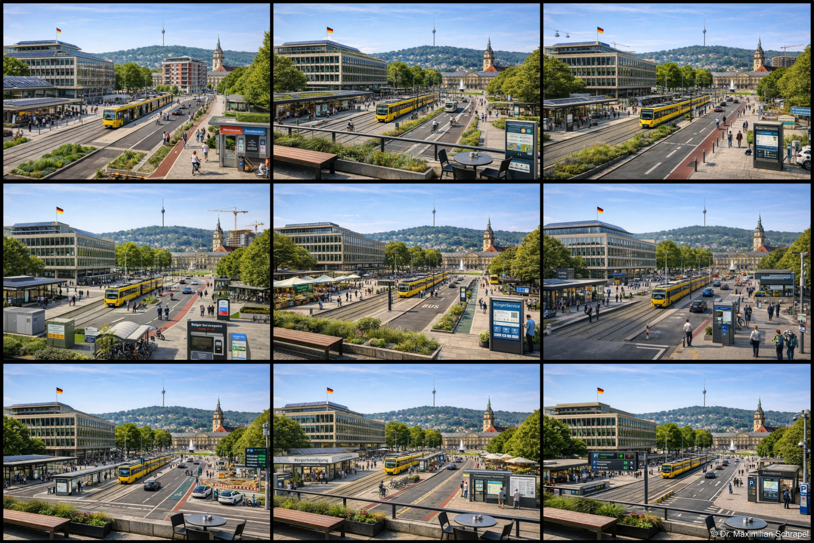

  

# Wahlhilfe GPT Landtagswahl BW 2026

Die **Wahlhilfe** ist ein neutrales Tool, das dabei helfen soll, **Wahlprogramme zur Landtagswahl Baden-Württemberg 2026** schneller zu strukturieren und besser zu verstehen.  
Statt eine Wahlentscheidung vorzugeben, unterstützt sie dabei, Positionen zu Themen zu vergleichen, Themen gezielt im Original Wahlprogramm wiederzufinden und eigene Prioritäten systematisch zu reflektieren.

Dieses Repository sammelt Prompts, Vorlagen sowie begleitende Materialien, inklusive Bildprompt Templates und Zitierhinweisen.

## Direkt zum GPT
➡️ **Wahlhilfe öffnen:**  
[Landtagswahl Baden Württemberg 2026 Wahlprogramme (Wahlhilfe GPT)](https://chatgpt.com/g/g-6981402d10e881918e6aed72c69e64dd-landtagswahl-baden-wurttemberg-2026-wahlprogramme/)

## Bildgenerierung: Visual Policy Translator

Mit dem Prompt Template in diesem Repository kannst du aus einem Referenzbild eine **photorealistische, plausible Ummodellierung** generieren.  
Ziel ist eine neutrale Visualisierung, wie ein konkretes Stadtbild aussehen könnte, wenn eine Partei über mehrere Jahre Schwerpunkte aus ihrem Wahlprogramm umsetzt, ohne Propaganda, ohne Logos, ohne Bewertung.

### Beispiel Output: Übersicht über mehrere Parteien
Das folgende Bild ist ein Beispiel für eine „alle Parteien“ Übersicht, bei der dieselbe Perspektive mehrfach mit unterschiedlichen Partei Einstellungen generiert wurde.

### Dateien
- Referenzbild: [`Bilder/Stuttgart_referenz.png`](Bilder/Stuttgart_referenz.jpg)
- Prompt Template: [`Prompts/Bildgenerierung.txt`](Prompts/Bildgenerierung.txt)
- Anleitung zur Nutzung: [`Prompts/README.md`](Prompts/README.md)

### Kurzablauf
1. Referenzbild in ChatGPT als Attachment hochladen.
2. `Prompts/Bildgenerierung.txt` öffnen und die Platzhalter setzen (Partei, Intensität, Zeithorizont).
3. Prompt vollständig in ChatGPT einfügen und Bild generieren.
4. Ergebnisbilder im Ordner `Bilder/` speichern (empfohlene Benennung, z. B. `Stuttgart_CDU_MED.png` oder `Stuttgart_Gruene_LOW.png`).

## Hinweise zur Nutzung
Dieses Tool ersetzt **keine Wahlentscheidung**, sondern hilft dabei, Wahlprogramme besser zu verstehen.

Die hier genannten Standpunkte sind unbedingt in den **Original Wahlprogrammen** zu überprüfen:  
[Wahlprogramme 2026 auf landtagswahl-bw.de](https://www.landtagswahl-bw.de/wahlprogramme-2026)

**Diese Wahlprogrammanalyse ist kein offizielles Angebot einer Behörde, Partei oder Redaktion und keine Wahlberatung. Sie soll dabei helfen, Wahlprogramme zu strukturieren und besser zu verstehen.**

## Lizenz
- **Code**: MIT License (siehe [`LICENSE`](LICENSE))
- **Prompts und Text Inhalte**: frei für Forschung und Bildung, mit Namensnennung (siehe [`LICENSE-CONTENT-RESEARCH.md`](LICENSE-CONTENT-RESEARCH.md))
- **Kommerzielle Nutzung**: nur mit schriftlicher Lizenz (siehe [`LICENSE-CONTENT-COMMERCIAL.md`](LICENSE-CONTENT-COMMERCIAL.md))
- **Name und Logo**: siehe [`TRADEMARK.md`](TRADEMARK.md)

## Zitieren
- Für GitHub Zitierung: [`CITATION.cff`](CITATION.cff)
- Für BibTeX: [`CITATION.bib`](CITATION.bib)
